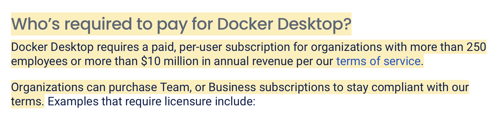

# No more Docker Desktop

<p align="center">
  
</p>

## Why docker desktop is not great

You do not like docker desktop? I don't like it for the reasons below:
- Resource hungry
- Not open source
- Not free 
- Black box



## What can you do about it?

You are in luck, this repo is just for that reason, getting rid of docker desktop.

# Alternative
List of alternatives:
- Combo 1: 
  - [lazydocker](https://github.com/jesseduffield/lazydocker)
  - [colima](https://github.com/abiosoft/colima)

(Wait for more alternative combo from PR)

# Tutorials for the combos

## Combo 1:

#### Step 1: Install colima
```zsh
brew install colima
```
#### Step 2: Install docker (If you haven't)
```zsh
brew install docker
```
#### Step 3: Install buildx (This is essential)
Now you may ask why? buildx is bundled with docker desktop, if you don't install buildx colima will use a deprecated version of docker build, which will not be a good replacement for docker desktop. Hence, this step is a must.

Steps to install buildx for apple silicon (TODO: add in other systems)
```zsh
RELEASE_FILE_SUFFIX='darwin-arm64'

rm *.$RELEASE_FILE_SUFFIX
gh release download --repo 'github.com/docker/buildx' --pattern "*.$RELEASE_FILE_SUFFIX"
mkdir -p ~/.docker/cli-plugins
mv -f *.$RELEASE_FILE_SUFFIX ~/.docker/cli-plugins/docker-buildx
chmod +x ~/.docker/cli-plugins/docker-buildx
docker buildx version # verify installation
```

### Step 4: Run colima (replace docker)
Below is my recommended configuration for Apple silicon colima
```
colima start --arch aarch64 --vm-type vz --cpu 10 --memory 16
```
NOTES: replace correct cpu (CORE) and memory (RAM) as to your liking
- arch : aarch64 -> apple silicon
- vm-type : vz -> apple virtulization [can read more here](https://developer.apple.com/documentation/virtualization). This is better than qemu on Docker Desktop but might have some issues (no issues for me so far).
- cpu and memory are clear!

Now you can try typing in `docker info` and see the result, docker is running fine just like having docker desktop. (even faster for vz)

### Step 5: Install lazydocker
Now you already got the docker but only in CLI but no UI. Don't worry i got a thing even better, let install lazydocker.
```zsh
brew install lazydocker
```

### Step 6: Set up docker host for lazydocker
Because colima doesn't use the same path for `DOCKER_HOST` we need to set that up properly, don't worry i got one liner for you. Just run (in MacOS).
```zsh
echo export DOCKER_HOST="unix://$HOME/.colima/docker.sock" >> ~/.zshrc
```
You can replace `.zshrc` with `.bashrc` or if you're not using zsh, but zsh is the default on MacOS now.

### Step 7: Run lazydocker (replace docker desktop UI)
Now you can just run the UI by run this in the terminal
```zsh
lazydocker
```


# Contribution
You you wish to contribute your own "combo" to get rid of Docker Desktop, please feel free to make a PR directly to this repo. Let's make docker open source and awesome!